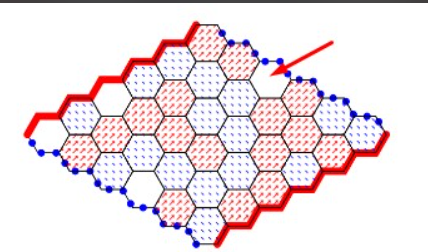

## Question 1

Since the agent is ratinonal and there exist a move that makes him win , he will choose this move as shown in the figure.

## Question 2

The agent wants to minimize the cost and time of the path so we can propose the following utility function : 

$\Sigma_{i} c_{i} + t_{i} $

We can add weights for the time and cost to make the agent more flexible and choose which variable is more important
 
$\Sigma_{i} c_{i} * w_{c} + t_{i} * w_{t} $

where $w_{c}$ and $w_{t}$ are some constants depending on the problem.

## Question 3

If we consider the utility function as the expected gain from each lottery we have  : 
$E(A_{1}) = 10 000$ 
$E(A_{2}) = 13 500$ 
so we actually have the lottery $A_{2}$ have the most gain which makes the agents  seems not rational.But 
in reality the lottery $A_{1}$ is deterministic so we are sure that will win something without having to risk anything.

For the expected gain from $B_{1}$ and $B_{2}$ we have :
$E(B_{1}) = 1 000$ 
$E(B_{2}) = 1 350$ 
so $B_{2}$ have the more important gain and with almost equal probability of gain with $B_{1}$ and that's why it's logic to choose $B_{2}$.

	
## Question 4

Since the agents thinks that it is highly unlikely that the other participants will propose a price more than 80$,
and that he estimates the value of the item to be equal to 100$, he will propose a price that garantees him the win
(according to his belief) and maximizes his gain (which is equal to 100$ minus his proposition). So the agent will 
propose 80$ or 81$

## Question 5

Let's suppose our agent estimates an item i for a value Vi. Now, let's suppose that the agent proposes a value less than Vi.

There are two different possible cases to consider:
1. The first case is that the value proposed by our agent is the highest value amongst the different proposition.
In this case, the agent will be paying the second highest value which is proposed by the other agents. Thus, proposing 
a value less than Vi didn't change the price he is going to pay but it did in fact increase his risk of not winning the bid.
So it would have been better for him to propose Vi in the first place.

2. The second case is that our agent doesn't win the bid, i.e the value he proposed wasn't the maximum proposed value amongst
the different agents. In this case, the agent could have won the bet had he proposed Vi. 

So in both cases, the agent doesn't have an interest in lowering the price of his proposition.

## Question 6

The target agent has the highest utility with its dishonest strategy. Also we see that honest agents have zero utilities on average. This is due to their strategy.

## Question 7

the Target agent no longer has the best use. Indeed, the other agents were able to accumulate more utility. This is explained by the fact that the agents who offer their property valuations are the ones who earn the most (as demonstrated in question 5).

